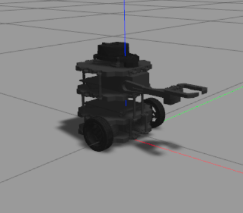
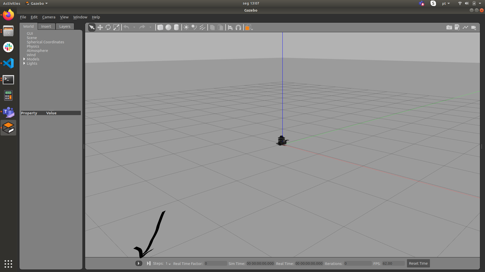
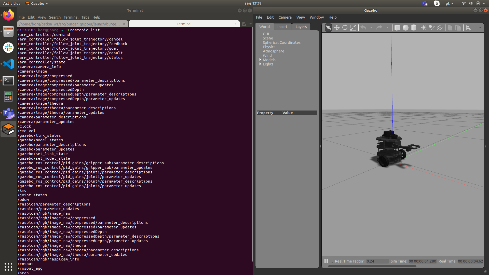
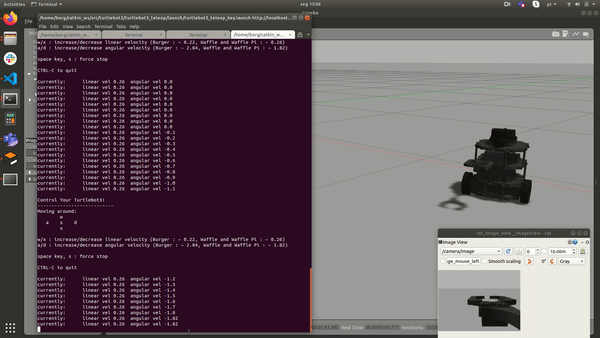

# Upgrades no TurtleBot3 Burger 
    
### Implementaçãções Testadas

 -   Camera
 -   IMU
 -   Scan
 -   Cmd vel
 -   Bumper

### Em desenvolvimento

  - Garra

### Para Utilizar

Abra um terminal Crtl+Alt+t e entre no seu workspace do ROS:

    cd ~/catkin_ws/src
    
Clone este repositorio dentro da pasta catkin_ws/src.

    git clone https://github.com/Insper/burger_gripper

Execute o comando catkin_make na pasta raiz catkin_ws   

    cd ~/catkin_ws
    catkin_make

### Agora vamos rodar os launchs necessários

Abra um novo terminal <kbd>Crtl</kbd>+<kbd>Alt</kbd>+<kbd>t</kbd> e suba o Burger no gazebo:

    roslaunch burger_gripper burger_gripper_gazebo.launch  
    

Não se esqueça de apertar o PLAY no Gazebo para iniciar a simulação;

 

Em um outro terminal  <kbd>Crtl</kbd>+<kbd>Shift</kbd>+<kbd>t</kbd> visualize os topicos diponiveis:

    rostopic list

    
    
Em um outro terminal  <kbd>Crtl</kbd>+<kbd>Shift</kbd>+<kbd>t</kbd> visualize as imagens da câmera no Burger:

    rqt_image_view

   
Em um outro terminal <kbd>Crtl</kbd>+<kbd>Shift</kbd>+<kbd>t</kbd> suba o teleop para navegar com Burger pelo cenário;

    roslaunch turtlebot3_teleop turtlebot3_teleop_key.launch
  
 ## O resultado deve ser parecido com isso 
  
 
 

 
 

    
    
    
    
    
 

